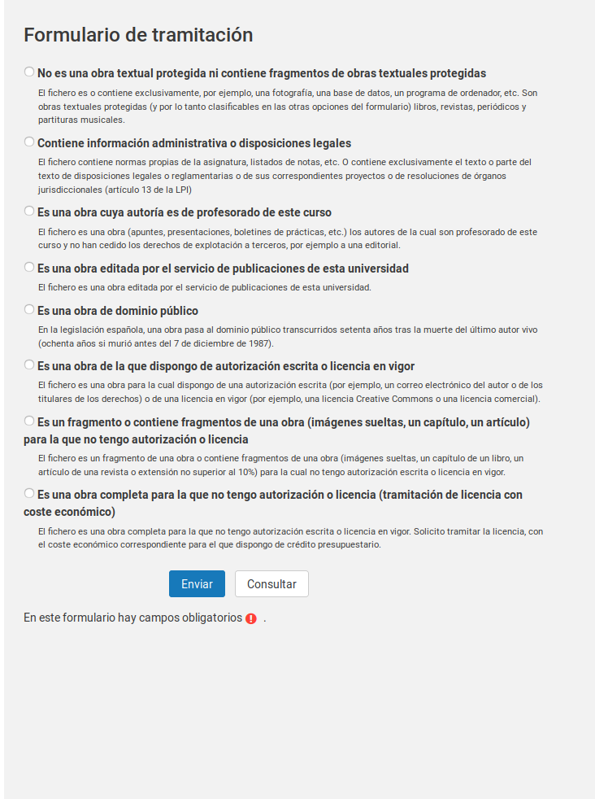
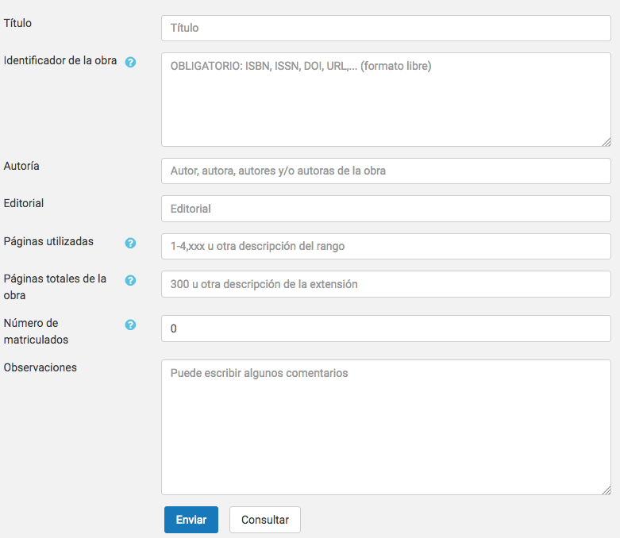

# Introducción

La primera parte de esta guía proporciona una orientación al profesorado sobre
sus obligaciones y derechos al publicar una obra o fragmento de una obra en el
Aula Virtual. Encontrarás más información en
[http://www.uji.es/serveis/cd/bib/serveis/investigacio/pi](http://www.uji.es/serveis/cd/bib/serveis/investigacio/pi).
La segunda parte de esta guía describe el módulo de Gestión de Derechos de
Propiedad Intelectual (GDPI) integrado en el Aula Virtual de la Universitat
Jaume I.

Únicamente consideramos obras impresas o susceptibles de serlo (en adelante,
"obras impresas"). No consideramos otro tipo de
obras (audiovisuales, música...) porque:

- el [**Texto Refundido de la Ley de Propiedad
Intelectual (TRLPI)**](https://www.boe.es/buscar/act.php?id=BOE-A-1996-8930) solo da
a este tipo de obras un tratamiento excepcional que permite su publicación en un
contexto educativo o de investigación científica
- y existe un **convenio entre CRUE**[^1] **y CEDRO**[^2]**-VEGAP**[^3] que nos
habilita para la reproducción de fragmentos de obras impresas con ciertas limitaciones.

[^1]: [CRUE](http://www.crue.org/) es la Conferencia de Rectores de Universidades Españolas.

[^2]: [CEDRO](http://www.cedro.org/) es el Centro Español de Derechos Reprográficos, una entidad de gestión colectiva de derechos de propiedad intelectual para autores y editores de obras impresas o susceptibles de serlo.

[^3]: [VEGAP](http://www.vegap.es/) es la Visual Entidad de Gestión de Artistas Plásticos, una entidad de gestión colectiva de derechos de propiedad intelectual para pintores, escultores, fotógrafos, ilustradores, diseñadores, videoartistas, arquitectos y creadores visuales en general.

En ausencia de convenio con EGEDA, SGAE u otras entidades de gestión de
derechos de propiedad intelectual, no deberían publicarse en el Aula Virtual
obras o fragmentos de obras de naturaleza audiovisual si no se cuenta con las
correspondientes licencias.

El módulo de gestión de derechos de propiedad intelectual del aula virtual
trata de asegurar que los usos de obras o de fragmentos de obras impresas se
ajustan a la legalidad. Al mismo tiempo, recopila información para determinar
criterios de reparto justo de la remuneración equitativa entre los titulares de
derechos a la que da derecho la ley.

La información recogida sobre las obras publicadas es auditable por las
entidades de gestión, es decir, estas pueden verificar la veracidad de los
datos que suministramos sobre ellas. Esto implica que las entidades de gestión
puedan acceder puntualmente al contenido de los ficheros junto a sus datos
descriptivos. En ningún caso puede acceder la entidad de gestión a una
asignatura del curso del aula virtual: solo puede auditar el contenido y los
datos del fichero que contiene una obra o un fragmento de obra impresa. Tampoco
pueden acceder a los documentos administrativos que contienen información
normativa de las asignaturas, resultados de evaluación de los alumnos,
etcétera, pues contienen o pueden contener datos personales sujetos a
protección.

# Derechos y deberes respecto de la publicación en el Aula Virtual de obras protegidas

El Texto Refundido de la Ley de Propiedad Intelectual (TRLPI) determina los
derechos del autor de obras literarias, artísticas o científicas. El autor
tiene el derecho exclusivo a la explotación de su obra en cualquier forma
(artículo 2 del TRLPI) y puede transmitirlo a otras personas físicas o
jurídicas (artículos 42 y 43) por escrito (artículo 45).

La publicación del fragmento de una obra a través del Aula Virtual constituye
un acto de **puesta a disposición del público** que facilita la **reproducción
parcial*+ de la obra (artículo 20). Este acto **requiere la autorización** del
titular de los derechos de explotación, con las excepciones que determina la
ley (que comentamos más adelante), y **puede generar obligaciones económicas**
para la universidad.

Así pues, es importante distinguir entre la necesidad o no de disponer de
**autorización** para el acto y la generación o no de **obligaciones
económicas** para la universidad. Esto dependerá de diferentes circunstancias:
de si la obra está en el dominio público o no, de si tenemos licencia para
realizar el acto, de la extensión y naturaleza de la obra...

## Publicación de una obra de dominio público

Una obra es de dominio público cuando está libre de toda exclusividad en su
acceso y uso. En España, las obras pasan a ser de dominio público cuando han
transcurrido setenta años desde la muerte del autor (artículo 26).

La comunicación pública y reproducción de obras de dominio público **no
requiere autorización** y **no genera obligaciones económicas**. Es
responsabilidad de quien publica un documento asegurarse de que una obra es de
dominio público antes de publicarla en el Aula Virtual.[^4]

[^4]: Por la experiencia en el uso de la herramienta, se está etiquetando como de dominio público material que no presenta problemas para su publicación, pero que no debe clasificarse en este concepto.

## Reproducción de un pequeño fragmento de una obra protegida

Los centros de educación reglada, como las Universidades, **no necesitan
autorización** del titular de los derechos cuando reproducen *pequeños
fragmentos* de obras u *obras aisladas de carácter plástico o fotográfico
figurativo* (artículo 32.3), siempre que el uso se limite a la ilustración de
la actividad educativa y se use el nombre del autor y la fuente.[^5]

[^5]: Según el artículo 32.3, este derecho a la reproducción de un pequeño fragmento no da cobertura al uso de *libros de texto o manuales universitarios* en la educación reglada. Pero el artículo 32.4.c nos permite estas reproducciones siempre "que los actos se realicen en las universidades o centros públicos de investigación, por su personal y con sus medios e instrumentos propios". Estos actos no requieren autorización, pero generan una obligación económica para la universidad (que está siendo satisfecha en el marco del convenio CRUE-CEDRO/VEGAP que se comenta en el siguiente apartado).

Se entiende por *pequeño fragmento* un extracto o porción cuantitativamente
poco relevante con respecto del conjunto de la obra. Este tipo de actos **no
genera ninguna obligación económica** para la Universidad (artículo 32.3). El
TRLPI no detalla los umbrales que determinan con certeza si una porción de una
obra impresa o audiovisual puede calificarse de *pequeño fragmento*, por lo que
debe extremarse la prudencia.

## Reproducción parcial de una obra protegida

Según el artículo 32.4 del TRLPI, las universidades **no necesitan
autorización** del titular de los derechos para llevar a cabo actos de
*reproducción parcial de obras impresas* con fines educativos. La reproducción
debe limitarse a fragmentos consistentes en:

- un *capítulo de libro*,
- un *artículo de revista* (o extensión equivalente en publicación asimilada),
- o una porción cuya extensión no supere el *10% del total de la obra*.

Solo los estudiantes del curso (o sus profesores) han de poder acceder al
fragmento, por lo que el curso del Aula Virtual en el que se aloja el fragmento
*no puede estar abierto al público en general*.

La publicación del fragmento genera una **obligación económica** para la
universidad que **ya está siendo satisfecha**. La CRUE suscribió un convenio
con las entidades de gestión CEDRO y VEGAP que da cobertura a la publicación en
el Aula Virtual de fragmentos de obras impresas *hasta el 31 de diciembre de
2018*. El convenio determina una cuantía anual que es abonada por el conjunto
de las universidades y que permite que los autores perciban una *remuneración
equitativa* por estos actos. La remuneración equitativa ha de ser gestionada,
necesariamente, por una *entidad de gestión* de derechos de propiedad
intelectual.

Para asegurar que los autores perciben la remuneración equitativa se precisa
que el sistema registre los usos realizados en el Aula Virtual y que las
entidades de gestión tengan acceso a esta información. El sistema de gestión de
derechos que ponemos en explotación en el segundo semestre del curso 2017/2018
tiene ese objetivo.

Hay un par de excepciones que conviene conocer. La publicación d'un fragmento
de la obra como el descrito **no genera obligaciones económicas** para la
universidad (artículo 32.4) en los siguientes casos:

- Cuando **somos los titulares de los derechos de propiedad intelectual** y
acordamos la puesta a disposición de la obra en el Aula Virtual.
- Cuando **la propia universidad es cesionaria de los derechos de explotación**,
es decir, cuando la publicación ha sido editada por el Servicio de
Publicaciones de la UJI.

## Reproducción de una obra completa o de un fragmento significativo de una obra

Cualquier otro uso de una obra o de un fragmento de una obra **requiere
autorización expresa** del titular de los derechos y, por regla general, **está
sujeta a un pago**. El contrato que formaliza una cesión específica de uso,
copia o distribución de una obra recibe el nombre de **licencia**.

La gestión de la licencia puede realizarse a través de
[https://www.conlicencia.com/](https://www.conlicencia.com/) o contactando con
la editorial o el autor, si este no ha cedido los derechos a un tercero.

Por regla general la licencia está sujeta a un pago, por lo que se requiere
disponer de crédito presupuestario para su adquisición. La tramitación de una
licencia no es un proceso inmediato ni está automatizado, por lo que debe
planificarse y ejecutarse con suficiente antelación al período en que se
necesite el uso efectivo de la obra. El proceso es similar al de adquisición de
un libro, no depende solo de la universidad y puede tardar días, semanas o
meses.

Si cree que necesita una licencia, considere antes la conveniencia de adquirir
la obra impresa o en formato electrónico para su puesta a disposición de los
estudiantes a través de la Biblioteca.

# El módulo de gestión de derechos de propiedad intelectual del Aula Virtual

Con objeto de asegurar el cumplimiento del TRLPI en el Aula Virtual se ha
desarrollado e integrado un módulo de Gestión de Derechos de Propiedad
Intelectual (GDPI).

Aunque el sistema se ha diseñado con la máxima de interferir lo menos posible
en la actividad normal del Aula Virtual, se requiere la colaboración del
profesorado. Se ha tratado de facilitar al máximo el proceso de subida y
publicación de documentos, pero se debe efectuar un breve proceso de
tramitación para cada uno de ellos. El objetivo es recabar la información que
permita **determinar** si el fichero **necesita autorización** del autor y si
su reproducción **genera obligaciones económicas** para la universidad. En los
casos en que resulta necesario, el profesorado ha de proporcionar información
que identifique inequívocamente la obra o fragmento de obra utilizada.

Debe tenerse en cuenta que el sistema es auditable por las entidades de gestión
de derechos de propiedad intelectual, por lo que *siempre se ha proporcionar
información fidedigna y tan completa como sea posible*. Que el sistema sea
auditable significa que se permite el acceso al contenido y datos de cualquier
fichero, pero solo a los efectos de comprobar que se realiza una correcta
gestión de derechos de propiedad intelectual. Naturalmente, los ficheros que
contienen información administrativa propia de la asignatura (normativas de
evaluación, calificaciones de estudiantes...) están excluidos del acceso por
parte de las entidades de gestión.

## Subida de documentos al Aula Virtual

Durante el acto de subida del documento no es necesario cumplimentar ningún
dato relativo a la gestión de derechos de propiedad intelectual.

El fichero, que pasa a estar inmediatamente disponible para los estudiantes (a
menos que se oculte manualmente la actividad) se integra en una lista de
ficheros de los que está pendiente la gestión de derechos. Si, transcurrido un
plazo, no se ha efectuado la tramitación pertinente, la actividad que contiene
el documento se ocultará a los estudiantes automáticamente.

Es recomendable, por tanto, que *tan pronto se publique un documento se proceda
a tramitar la correspondiente acción de gestión de derechos*. En ningún caso
debe utilizarse este período de gracia como un mecanismo que permita poner un
documento a disposición de los estudiantes de modo que no respeten los derechos
de propiedad intelectual. A este respecto debe tenerse en cuenta que todo
documento pendiente de clasificar es auditable por la entidades de gestión.

El menú principal del Aula Virtual (panel a mano izquierda) incluye una opción
para acceder a la pantalla principal del módulo GDPI:

Si hay documentos pendientes de procesar, aparecerá un aviso en la pantalla
principal como este:

Pinchando en el botón "Iniciar revisión" se accede a la página principal del
módulo GDPI. Desde ella podemos iniciar el proceso de gestión de cada documento
y comprobar su estado. Conviene recordar que solo los ficheros que pueden
contener obras impresas han de someterse a este proceso de gestión de derechos.

## Pantalla principal del módulo GDPI

La pantalla principal presenta este aspecto:

En la pantalla aparece un listado con todos los ficheros que, por su tipo
(documento PDF, documento Word, documento OpenOffice/LibreOffice...), pueden
ser soporte de obras impresas. Bajo el listado se muestran opciones para
filtrar la relación de documentos que se muestran en el mismo.

### Listado de documentos

El listado presenta cinco columnas:

- **Selección de ficheros**: Es una casilla que permite seleccionar ficheros individual o conjuntamente para realizar sobre ellos acciones masivas.
- **Fecha de subida**: Fecha de creación del documento.
- **Fichero**: Nombre del documento. Pinchando en él se accede al documento para su descarga.
- **Visible**: Indica si el documento es accesible por los estudiantes en este momento.
- **Estado**: Muestra el estado de tramitación de la gestión de derechos de propiedad intelectual.

El listado se puede ordenar ascendente y descendentemente por cualquiera de los campos clicando en el título de la columna.

Es posible efectuar dos acciones para cada documento:

- **Gestionar**: Dirige al formulario de gestión de derechos del documento.
- **Consultar**: Dirige una solicitud de asesoramiento a personal especialista en gestión de derechos  de propiedad intelectual para resolver dudas relativas al fichero.

### Acciones masivas

Esta opción permite realizar la clasificación de más de un fichero a la vez, siempre que no se necesite información específica sobre cada uno de los ficheros.

Las opciones de tramitación disponibles son:

- **No es una obra textual protegida ni contiene fragmentos de obras textuales protegidas**
- **Contiene información administrativa o disposiciones legales**
- **Obra titularidad del profesorado de este curso sin cesión de derechos de explotación a terceros**
- **Obra editada por el servicio de publicaciones de esta universidad**
- **Obra de dominio público**

Consulte el apartado *Formulario de tramitación* de derechos de un documento para una descripción detallada de estas opciones.

### Opciones de filtrado

Dado que esta pantalla contiene un listado con todos los documentos publicados
en el Aula Virtual y este puede ser extenso, se proporcionan opciones de
filtrado que nos permiten centrar la atención en los documentos de interés.

La **primera opción** del filtro permite seleccionar:

- *todos los documentos* cuyo tipo permite deducir que es una obra impresa,
- solo los documentos que permanecen *ocultos* para los estudiantes (recuerde que los documentos para los que no se ha hecho gestión alguna pasan a este estado en un determinado plazo de tiempo),
- o solo los *visibles* para los estudiantes.

La **segunda opción** del filtro selecciona los documentos en función del estado
de tramitación :

- *Sin tramitar*: ficheros que tienen pendiente la tramitación de la gestión de derechos de propiedad intelectual.
- *En tramitación*: Se ha iniciado un procedo de tramitación de adquisición de una licencia que aún no ha concluido.
- *No autorizado*: ficheros para los que se ha resuelto que no es posible efectuar la publicación en el Aula Virtual.
- *Autorizado*: ficheros de los que se completado con éxito la tramitación y pueden publicarse en el Aula Virtual.
- *No es una obra textual protegida ni contiene fragmentos de obras textuales protegidas*: ficheros que son o contienen exclusivamente, por ejemplo, una fotografía, una base de datos, un programa de ordenador, etc.

La **tercera opción** del filtro selecciona los documentos en función del nombre del fichero. Permite el uso de *comodines* (como `*`, que representa a cualquier serie de caracteres) para consultas algo más complejas. Por ejemplo:

- *Fichero con nombre `apuntes.pdf`*: `apuntes.pdf`
- *Todos los ficheros con extensión `.zip`*: `*.zip`
- *Todos los ficheros que empiezan con `tema` y tienen extensión `pdf`: `tema*.pdf`
- *Todos los ficheros que contienen `tema` y tienen extensió `pdf`: `*tema*.pdf`
- *Todos los ficheros que contienen `tema`, con cualquier extensión: `*tema*.*`

La **cuarta opción** permite seleccionar la cantidad de ficheros a mostrar en cada página. De esta manera podemos reducir la necesidad de navegar por gran cantidad de páginas.

La **quinta opción** permite seleccionar los ficheros por la ubicación (la sección) de los mismos en el curso.

### Acción "Consulta"

Al pulsar en el botón "Consulta" aparece un formulario titulado "Consulta a
especialista en propiedad intelectual" con este aspecto:

El texto dice "*Su consulta será enviada por correo a un especialista en gestión
de derechos de propiedad intelectual. Obtendrá la respuesta en el buzón de
`su-dirección-de-correo@uji.es`*" y se muestra el nombre del fichero sobre el
que se quiere efectuar una consulta.

En el cajetín de texto podemos expresar la duda. La consulta se dirigirá por
correo electrónico a un especialista en gestión de derechos de propiedad
intelectual que tratará de resolverla en el más breve plazo posible. La
respuesta se recibirá por correo electrónico. El módulo GDPI no hace un
seguimiento de este proceso, que debe atenderse con el correo electrónico.

### Acción "Gestionar"

El botón "Gestionar" permite iniciar la tramitación de los derechos de propiedad
intelectual y conduce a un formulario algo más complejo.

El formulario ofrece una barra horizontal de navegación en la zona superior. La
zona principal de la pantalla se divide en un visor PDF que facilita su
identificación y posibilita su descarga y una zona con los campos que debe
rellenar el usuario.

Se debe escoger una opción de las que aparecen. Con ellas se resuelven varias cuestiones:

- ¿Se **necesita autorización** expresa del titular de los derechos, si lo hay, para poner el documento a disposición de los estudiantes?
- ¿Se **genera una obligación económica** para la universidad? Si se genera obligación, ¿está siendo atendida o requiere una gestión adicional?
- ¿Son **auditables por una entidad de gestión** tanto el contenido como los datos del fichero?

Ampliamos la imagen con las diferentes opciones y, a continuación, las
comentamos detenidamente:

#### Opción 1: "No es una obra textual protegida ni contiene fragmentos de obras textuales protegidas"

La opción se acompaña de un texto explicativo: "*El fichero es o contiene
exclusivamente, por ejemplo, una fotografía, una base de datos, un programa de
ordenador, etc. Son obras textuales protegidas (y por lo tanto clasificables en
las otras opciones del formulario) libros, revistas, periódicos y partituras
musicales.*"

Está opción debe seleccionarse cuando el sistema haya supuesto incorrectamente
que el fichero contiene una obra o un fragmento de un obra impresa o
susceptible de serlo. Seleccionando esta opción el documento se clasifica como
de otra naturaleza.

#### Opción 2: "Contiene información administrativa o disposiciones legales"

La opción se acompaña de un texto explicativo: "*El fichero contiene normas
propias de la asignatura, listados de notas, etc. O contiene exclusivamente el
texto o parte del texto de disposiciones legales o reglamentarias o de sus
correspondientes proyectos o de resoluciones de órganos jurisdiccionales
(artículo 13 de la LPI).*"

Los documentos de naturaleza administrativa (normativas de asignatura, rúbricas
de evaluación, listados con los resultados de evaluación de estudiantes,
etcétera) se pueden publicar sin necesidad de obtener autorización alguna.
Estos documentos son propios de la actividad administrativa de la universidad y
quedan fuera del ámbito de la gestión de derechos de propiedad intelectual. El
contenido del documento no puede ser consultado por las entidades de gestión
como parte de un proceso de auditoría automático, pues puede contener
información de carácter personal.

Esta opción también es aplicable a los ficheros que contienen exclusivamente el
texto o parte del texto de disposiciones legales o reglamentarias o de sus
correspondientes proyectos o de resoluciones de órganos jurisdiccionales
(artículo 13 de la LPI).

Si se escoge esta opción, no es necesario proporcionar datos descriptivos del
documento. Pulse el botón "Enviar" para completar el tratamiento del documento.  

#### Opción 3: "Es una obra cuya autoría es de profesorado de este curso"

La opción se acompaña de un texto explicativo: "*El fichero es una obra
(apuntes, presentaciones, boletines de prácticas, etc.) los autores de la cual
son profesorado de este curso y no han cedido los derechos de explotación a
terceros, por ejemplo a una editorial.*"

Cuando el autor o autores son parte del profesorado del curso en el que se da
la asignatura, han realizado la obra como parte de su trabajo y no han cedido 
los derechos de explotación a un tercero, el documento puede publicarse en el
Aula Virtual y no se generan obligaciones económicas para la universidad.

Este es el caso habitual de los boletines de problemas, exámenes de asignatura,
apuntes de clase, etcétera.

El contenido del documento puede ser consultado por las entidades de gestión
como parte de un proceso de auditoría.

Si se escoge esta opción, no es necesario proporcionar datos relativos al
documento. Pulse el botón "Enviar" para procesar el documento.

#### Opción 4: "Es una obra editada por el servicio de publicaciones de esta universidad"

Si la obra ha sido publicada por la universidad y esta es cesionaria de los
derechos de explotación, no se requiere autorización para su puesta a
disposición del público en el Aula Virtual. La reproducción no genera
obligaciones económicas para la universidad.

CRUE está trabajando en la firma de un convenio que permita a todas las
universidades compartir sus fondos editoriales. De momento, solo se puede
clasificar un fichero en esta opción si pertenece al fondo editorial de la UJI.

Si se escoge esta opción no es necesario proporcionar datos relativos al
documento. Pulse el botón "Enviar" para procesar el documento.

El contenido del documento puede ser consultado por las entidades de gestión
como parte de un proceso de auditoría.

#### Opción 5: "Es una obra de dominio público"

La opción se acompaña del siguiente texto explicativo: "*En la legislación
española, una obra pasa al dominio público transcurridos setenta años tras la
muerte del último autor vivo (ochenta años si murió antes del 7 de diciembre de
1987).*"

Las obras de dominio público se pueden publicar sin autorización y su uso no
genera obligaciones económicas.

Si se escoge esta opción, no es necesario proporcionar datos relativos al
documento. Pulse el botón "Enviar" para procesar el documento.

El contenido del documento puede ser consultado por las entidades de gestión
como parte de un proceso de auditoría.

#### Opción 6: "Es una obra de la que dispongo de autorización escrita o licencia en vigor"

La opción se acompaña del siguiente texto explicativo: "*El fichero es una obra
para la cual dispongo de una autorización escrita (por ejemplo, un correo
electrónico del autor o de los titulares de los derechos) o de una licencia en
vigor (por ejemplo, una licencia Creative Commons o una licencia comercial).*"

Al escoger esta opción se despliega este formulario:

El formulario contiene los siguientes campos:

- **Fecha de fin de la licencia**: Las licencias suelen tener una fecha de caducidad. Si la hay, se debe especificar en este campo. El sistema registrará la fecha y, si se reutiliza el material, no se volverá a solicitar un tratamiento de gestión de derechos para el fichero hasta que la licencia expire. Si la licencia es perpetua, se debe marcar la opción correspondiente.
- **Título** (opcional): Nombre que identifica a la obra o fragmento de la obra que se está utilizando.
- **Identificador de la obra** (requerido): Código de identificación de la obra, si lo hay. Si la obra dispone de ISBN o ISSN, debe usarse este identificador. Alternativamente, puede usarse algún otro descriptor que permita identificar la obra utilizada (DOI, URL, etcétera).
- **Autoría** (opcional): Nombre del autor o autores.
- **Licencia**: Descripción de la licencia.
- **Editorial** (opcional): Editorial que ha publicado la obra.
- **Páginas utilizadas**: número de páginas del fragmento utilizado. Si la obra no está paginada (se trata de un libro electrónico, por ejemplo) conviene indicar el porcentaje del fragmento respecto del total de la obra. El formato es libre, pero se recomienda usar, cuando sea posible, el número de página o los números de página inicial y final separados por un guión.
- **Páginas totales de la obra**: Número total de páginas de la obra. Si la obra no está paginada puede dejarse en blanco.
- **Observaciones**: Campo de formato libre con un comentario que acompañará al documento.

Las obras con licencias que no generan obligaciones económicas para usos no
comerciales caben en esta opción. Es el caso de Creative Commons y otras
licencias permisivas.

El contenido del documento y los datos pueden ser consultados por las entidades
de gestión como parte de un proceso de auditoría.

#### Opción 7: "Es un fragmento o contiene fragmentos de una obra (imágenes sueltas, un capítulo, un artículo) para la que no tengo autorización o licencia"

Si el fragmento tiene una entidad relativa (es un capítulo de libro, un
artículo de revista o no excede el 10% del total de la obra), esta opción abre
un nuevos formulario con campos que permitan identifican dicho fragmento:

Como se puede apreciar, todos menos uno forman subconjunto de los campos que se
despliegan en la opción 6, por lo que remitimos a dicha opción para una
explicación detallada de cada uno de ellos. El nuevo campo es:

- **Número de matriculados**: El sistema trata de determinar un valor por defecto para este campo, que se corresponde con el número de alumnos matriculados en la asignatura en el momento en el que se presenta el formulario. Como es posible que dicho número no se haya estabilizado o no sea fiable en el momento de subir el fichero al sistema, usted puede modificar el valor manualmente para reflejar el número real (aunque aproximado) de estudiantes que podrán acceder al material. Es preferible sobreestimar el número de estudiantes a infraestimarlo.

El fragmento se puede publicar sin solicitar autorización y la obligación
económica que genera su uso ha sido satisfecha en el marco del convenio
celebrado entre CRUE y CEDRO-VEGAP. El contenido y datos del documento pueden ser
consultados por las entidades de gestión como parte de un proceso de auditoría.

#### Opción 8: "Es una obra completa para la que no tengo autorización o licencia (tramitación de licencia con coste económico)"

Esta opción se debe escoger si el documento no cuenta con autorización para su
publicación y se dispone de crédito presupuestario para adquirir una licencia.

Se presenta un formulario de recogida de información idéntico al que se muestra
con la opción 7.

La actividad que contiene al documento pasará a estar oculta hasta disponer de
la licencia. Una vez se haya adquirido la licencia se podrá volver a tramitar
la gestión de derechos de propiedad intelectual del documento y mostrarlo a los
estudiantes del curso.

El proceso de adquisición de una licencia no es inmediato y, a fecha de hoy, no
es automatizable. Puede asimilarse al de adquisición de un libro, por lo que
puede tardar días, semanas o meses. La tramitación de la licencia **no depende
únicamente de los servicios de la universidad**. Considere la conveniencia de
adquirir ejemplares de la obra impresa o libros electónicos a través de la
Biblioteca antes de iniciar la tramitación de una licencia que limite el uso a
una asignatura del Aula Virtual.

# Cambios entre versiones del módulo

## Cambios respecto de la versión 0.3

- Se han añadido textos explicativos a las opciones, que además se han reordenado.
- Se permite una gestión por tandas de los ficheros (acciones masivas).

## Cambios respecto de la versión 0.2

- Cambiamos la redacción de las opciones del formulario de tramitación.
- Permitimos redimensionar las areas de previsualización y formulario de tramitación.
- El campo Observaciones del formulario de tramitación permite introducir más información.
- Añadida funcionalidad de copia de seguridad y restauración de los metadatos del fichero.
- Añadimos nuevos contextos para explorar la existencia de ficheros como las secciones de los cursos.
- Excluídos los ficheros de la zona de backup de los módulos.

## Cambios respecto de la versión 0.1

- El botón "Tramitar" en la página principal del módulo se ha renombrado como "Gestionar".
- El botón "Tramitar" en el formulario de gestión de cada documento se ha renombrado como "Enviar".
- Se ha incluído la opción "No es una obra impresa o susceptible de serlo (fotografías, código de ordenador, base de datos, ...)" del formulario de gestión de un documento y su documentación.
- Se ha modificado la opción "Información administrativa (normativa interna, listados de notas...)", que pasa a ser "Disposiciones legales e información administrativa (leyes, resoluciones, normativa interna de la universidad, listados de notas...)". Se optó por modificar una opción existente y no por añadir una nueva para no complicar más la interfaz.
- Modificado el texto de la opción "Una obra de titularidad del profesorado de la universidad" por "Obra cuya autoría es de profesorado de la universidad y no han cedido los derechos de explotación a un tercero".
- Modificado el texto de la opción "Otros (tramitación de licencia con coste económico)" por "No tengo licencia en vigor (tramitación de licencia con coste económico)".
- Se ha añadido al formulario de gestión una casilla para indicar si una licencia es perpetua.
- El filtro de documentos de la página principal incluye una nueva opción: "No és una obra impresa o susceptible de serlo".
- La página principal incluye un campo "Fecha de subida" con la fecha de creación de cada fichero.
- Es posible ordenar los ficheros por cualquiera de los campos. También se pueden mostrar u ocultar los campos a voluntad.
- Se pueden restablecer las preferencias de la tabla, de modo que vuelva a mostrarse con su configuración por defecto.
- Añadido filtro por nombre de fichero en la Tabla de tramitación.
- Añadido filtro de número de ficheros por página en Tabla de tramitación.
- Añadido filtro por sección de la Tabla de tramitación.
