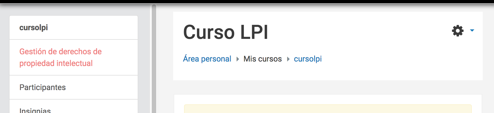
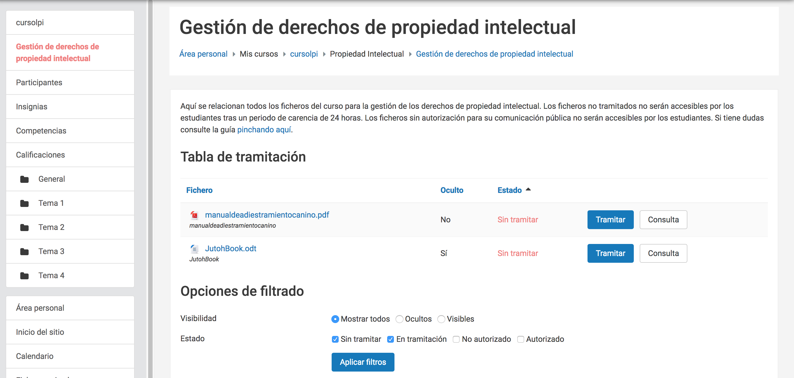
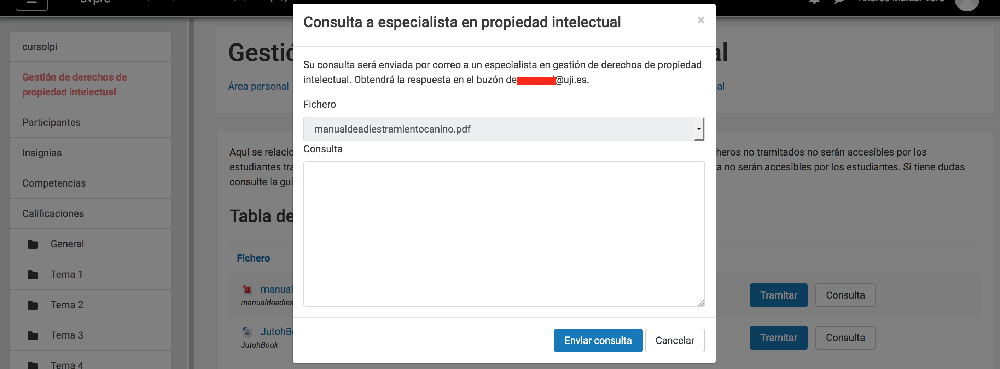
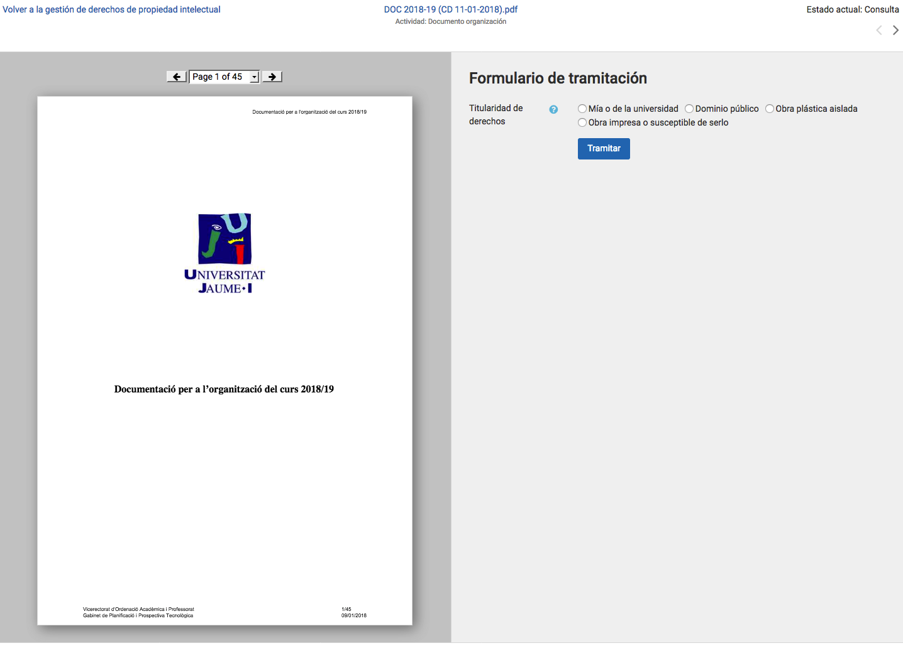
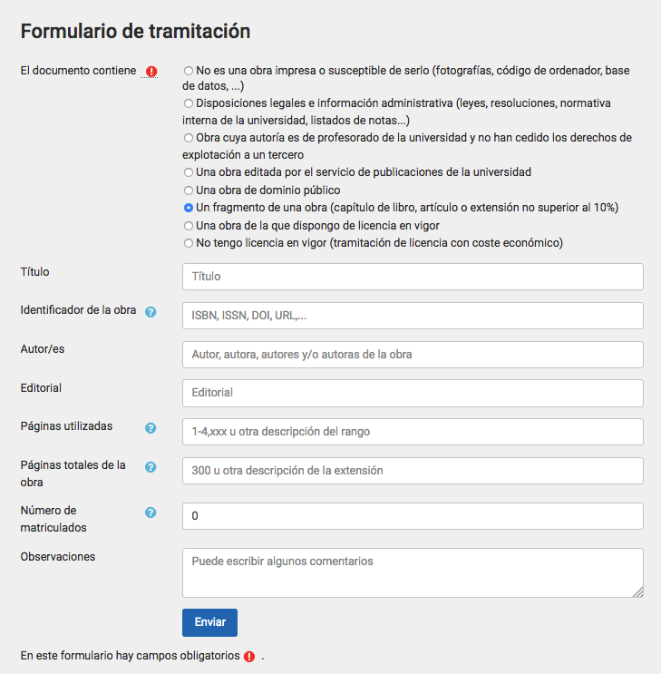

# Introducción

La primera parte de esta guía proporciona una orientación al profesorado sobre
sus obligaciones y derechos al publicar una obra o fragmento de una obra en el
aula virtual.

La guía se centra en las obras impresas o susceptibles de serlo y en obras
plásticas aisladas. No se considera otro tipo de obras (audiovisuales,
música...) porque:

- el [**Texto Refundido de la Ley de Propiedad
Intelectual**](https://www.boe.es/buscar/act.php?id=BOE-A-1996-8930) (**TRLPI**) da
un tratamiento específico a este tipo de obras que permite su publicación en un
contexto educativo
- y existe un **convenio entre CRUE y CEDRO-VEGAP** que nos
habilita para la reproducción de fragmentos de obras impresas o susceptibles de
serlo (con ciertas limitaciones).

En ausencia de convenio con EGEDA, SGAE u otras entidades de gestión, no
deberían publicarse en el aula virtual obras o fragmentos de obras de
naturaleza audiovisual si no se cuenta con las correspondientes licencias.

La segunda parte de esta guía describe el módulo de Gestión de Derechos de
Propiedad Intelectual (GDPI) integrado en el aula virtual de la Universitat
Jaume I. El sistema trata de asegurar que los usos de obras o de fragmentos de
obras impresas o susceptibles de serlo se ajustan a la legalidad. Al mismo
tiempo, recopila información para determinar criterios de reparto justo de la
remuneración equitativa a la que da derecho la ley.

La información recogida sobre las obras publicadas es auditable por las
entidades de gestión, es decir, estas pueden verificar su corrección. Esto
implica que las entidades de gestión puedan acceder puntualmente al contenido
de los ficheros junto a sus datos descriptivos (salvo al de los documentos
administrativos que contienen información normativa de las asignaturas,
resultados de evaluación de los alumnos, etcétera.)

# Derechos y deberes respecto de la publicación en el aula virtual de obras protegidas

El TRLPI determina los derechos del autor de obras literarias, artísticas o
científicas. El autor tiene el derecho exclusivo a la explotación de su obra en
cualquier forma (artículo 2 del TRLPI) y puede transmitirlo por escrito
(artículo 45) a otras personas físicas o jurídicas (artículos 42 y 43).

La puesta a disposición de los estudiantes del fragmento de una obra a través
del aula virtual constituye un acto de **comunicación pública** (artículo 20)
que facilita su **reproducción** (artículo 18). Este acto **requiere la
autorización** del titular de los derechos de explotación, con las excepciones
que determina la ley (que comentamos más adelante), y **puede generar obligaciones económicas** para la
universidad.

Así pues, conviene distinguir entre la necesidad o no de disponer de
**autorización** y la generación o no de **obligaciones económicas**.

## Publicación de una obra de dominio público

Una obra es de dominio público cuando está libre de toda exclusividad en su
acceso y uso. En España, las obras pasan a ser de dominio público cuando han
transcurrido setenta años desde la muerte del autor (artículo 26).

La comunicación pública y reproducción de obras de dominio público **no
requiere autorización** y **no genera obligaciones económicas**. Es
responsabilidad de quien publica un documento asegurarse de que una obra es de
dominio público antes de publicarla en el aula virtual.

## Reproducción de un pequeño fragmento de una obra protegida

Los centros de educación reglada, como las Universidades, **no necesitan
autorización** del titular de los derechos cuando reproducen *pequeños
fragmentos* de obras u *obras aisladas de carácter plástico o fotográfico
figurativo* (artículo 32.3), siempre que el uso se limite a la ilustración de la
actividad educativa y se use el nombre del autor y la fuente. La obra de la que
se extraen los pequeños fragmentos *no puede ser un libro de texto o manual
universitario* (artículo 32.3).

Se entiende por *pequeño fragmento* un extracto o porción cuantitativamente
poco relevante con respecto del conjunto de la obra. Este tipo de actos **no
genera ninguna obligación económica** para la Universidad (artículo 32.3). El
TRLPI no detalla los umbrales que determinan con certeza si una porción de una
obra impresa o audiovisual puede calificarse de *pequeño fragmento*, por lo que
debe extremarse la prudencia.

## Reproducción parcial de una obra protegida

Según el artículo 32.4 del TRLPI, las universidades **no necesitan
autorización** del titular de los derechos para llevar a cabo actos de
*reproducción parcial de obras impresas (o susceptibles de serlo)* con fines
educativos. La reproducción debe limitarse a fragmentos consistentes en:

- un *capítulo de libro*,
- un *artículo de revista* (o extensión equivalente en publicación asimilada),
- o una porción cuya extensión no supere el *10% del total de la obra*.

Solo los estudiantes del curso (o sus profesores) han de poder acceder al
fragmento, por lo que el curso del aula virtual en el que se aloja el fragmento
*no puede estar abierto al público*.

La publicación **no genera obligaciones económicas** para la universidad
(artículo 32.4) en lo siguientes casos:

- Cuando somos los titulares de los derechos de propiedad intelectual y
acordamos la puesta a disposición de la obra en el aula virtual.
- Cuando la propia universidad es cesionaria de los derechos de explotación,
es decir, cuando la publicación es editada por el Servicio de
Publicaciones de la UJI.

En el resto de casos (un capítulo, un artículo o hasta al 10%) se genera una
**obligación económica** para la universidad que **ya está siendo satisfecha**.
La Conferencia de Rectores de Universidades Españolas (CRUE) suscribió un
convenio con las entidades de gestión CEDRO y VEGAP que da cobertura a la
publicación en el aula virtual de fragmentos de obras impresas o susceptibles
de serlo hasta el 31 de diciembre de 2018. El convenio determina una cuantía
anual que es abonada por el conjunto de las universidades y que permite que los
autores perciban una *remuneración equitativa* por estos actos. La remuneración
equitativa ha de ser gestionada, necesariamente, por una *entidad de gestión*
de derechos de propiedad intelectual.

Para asegurar que los autores perciben la remuneración equitativa se precisa
que el sistema registre los usos realizados en el aula virtual y que las
entidades de gestión tengan acceso a esta información. El sistema de gestión de
derechos que ponemos en explotación en el segundo semestre del curso 2017/2018
tiene ese objetivo.

## Reproducción de una obra completa o de un fragmento significativo de una obra

Cualquier otro uso de una obra o de un fragmento de una obra **requiere
autorización expresa** del titular de los derechos y, por regla general, **está
sujeta a un pago**. El contrato que formaliza una cesión específica de uso,
copia o distribución de una obra recibe el nombre de **licencia**.

La universidad facilita la tramitación de licencias a través de un formulario
en el sistema de gestión de derechos del aula virtual. Los costes que ocasione
la licencia deberán asumirse presupuestariamente por el departamento o centro
responsable de la asignatura.

La tramitación de una licencia no es un proceso inmediato ni está automatizado,
por lo que debe planificarse y ejecutarse con suficiente antelación al período
en que se necesite el uso efectivo de la obra. El proceso puede durar desde
unos pocos días a varias semanas.

Por favor, los trámites de gestión de licencia deben inicarse *solo* si se
dispone de crédito presupuestario para cubrir el gasto correspondiente y se
actúa con suficiente antelación.

# El módulo de gestión de derechos de propiedad intelectual del aula virtual

Con objeto de asegurar el cumplimiento del TRLPI en el aula virtual se ha
integrado un módulo de Gestión de Derechos de Propiedad Intelectual (GDPI).

Aunque el sistema se ha diseñado pensando en interferir lo menos posible en la
actividad normal de uso del aula virtual, se requiere la colaboración del
profesorado. Se ha facilitado al máximo el proceso de subida y publicación de
documentos, pero se debe efectuar una tramitación para cada uno de ellos. El
objetivo es recabar la información que permita determinar si el fichero
necesita autorización del autor y si su reproducción genera obligaciones
económicas para la universidad. En ciertos casos, el profesorado ha de
proporcionar información que identifique inequívocamente la obra o fragmento de
obra utilizada. Debe tenerse en cuenta que el sistema es auditable por las
entidades de gestión de derechos, por lo que *siempre se ha proporcionar
información fidedigna*. Que el sistema sea auditable significa que se permite
el acceso al contenido y datos de cualquier fichero solo a los efectos de
comprobar que se efectúa una correcta gestión de derechos de propiedad
intelectual. Naturalmente, los ficheros que contienen información
administrativa propia de la asignatura (normativa de evaluación, calificaciones
de estudiantes...) están excluidos del acceso por parte de las entidades de
gestión.

## Subida de documentos al aula virtual

Durante el acto de subida del documento no es necesario cumplimentar ningún
dato relativo a la gestión de derechos de propiedad intelectual.

El fichero, que pasa a estar inmediatamente disponible para los estudiantes (a
menos que se oculte manualmente la actividad) se integra en una lista de
ficheros de los que está pendiente la gestión de derechos. Si, transcurrido un
plazo, no se ha efectuado la tramitación pertinente, la actividad que contiene
el documento se ocultará a los estudiantes automáticamente.

Es recomendable, por tanto, que *tan pronto se publique un documento se proceda
a tramitar la correspondiente gestión de derechos*.

El menú principal del aula virtual (panel a mano izquierda) incluye una opción
para acceder a la pantalla principal del módulo GDPI:

## Aviso de que hay documentos pendientes de gestión de derechos

Si hay documentos pendientes de procesar, aparecerá un aviso en la pantalla
principal como este:

Cabe recordar que solo los ficheros que pueden contener obras impresas o
susceptibles de serlo han de someterse a este proceso de gestión de derechos.

Pinchando en el botón "Iniciar revisión" se accede a la página principal del
módulo GDPI. Desde ella podemos iniciar el proceso de gestión de cada documento
y comprobar su estado.

## Pantalla principal del módulo GDPI

La pantalla principal presenta este aspecto:

En la pantalla aparece un listado con todos los ficheros que, por su tipo
(documento PDF, documento Word, documento OpenOffice/LibreOffice...), pueden
corresponderse con obras impresas o susceptibles de serlo. Bajo el listado se
muestran opciones para filtrar la relación de documentos que se muestran en el
mismo.

### Listado de documentos

El listado presenta tres columnas
informativas:

- **Fichero**: Nombre del fichero. Pinchando en él se accede al documento para su descarga.
- **Oculto**: Indica si el fichero es accesible por los estudiantes en este momento.
- **Estado**: Es el estado de tramitación de la gestión de derechos de propiedad intelectual.

Acompaña a cada documento, además, la posibilidad de efectuar dos acciones:

- **Tramitar**: Dirige al formulario de gestión de derechos del documento.
- **Consulta**: Dirige una solicitud de asesoramiento a personal especialista en gestión de derechos  de propiedad intelectual para resolver dudas relativas al fichero.

### Filtro de documentos

Dado que esta pantalla contiene un listado con todos los documentos publicados
en el aula virtual y este puede ser extenso, se proporcionan opciones de
filtrado que nos permiten centrar la atención en los documentos de interés.

La **primera opción** del filtro permite seleccionar:

- *todos los documentos* cuyo tipo permite deducir que es una obra impresa o susceptible de serlo,
- solo los documentos que permanecen *ocultos* para los estudiantes (recuerde que los documentos para los que no se ha hecho gestión alguna pasan a este estado en un determinado plazo de tiempo),
- o solo los *visibles* para los estudiantes.

La **segunda opción** del filtro selecciona los documentos en función del estado
de tramitación :

- *Sin tramitar*: ficheros que tienen pendiente la tramitación de la gestión de derechos de propiedad intelectual.
- *En  tramitación*: ficheros de los que se ha solicitado la gestión de una licencia y no se tiene respuesta.
- *Autorizado*: ficheros de los que se completado con éxito la tramitación y pueden publicarse en el aula virtual.
- *No autorizado*: ficheros para los que se ha resuelto que no es posible efectuar la publicación en el aula virtual.

### Acción "Consulta"

Al pulsar en el botón "Consulta" aparece un formulario como este:

En el cajetín de texto podemos expresar la duda. La consulta se dirigirá por
correo electrónico a un especialista en gestión de derechos de propiedad
intelectual que tratará de resolverla en el más breve plazo posible. La
respuesta se recibirá por correo electrónico, por lo que el módulo GDPI no hace
un seguimiento de este proceso.

### Acción "Tramitar"

El botón "Tramitar" permite iniciar la tramitación de los derechos de propiedad
intelectual y conduce a un formulario algo más complejo.

El formulario ofrece una barra horizontal de navegación en la zona superior. La
zona principal de la pantalla se divide en un visor PDF que facilita su
identificación y posibilita su descarga y una zona con los campos que debe
rellenar el usuario.

Se debe escoger una opción de las que aparecen a la derecha de la etiqueta "El
documento contiene". Con ellas se clasifica el documento en relación con dos cuestiones:

- ¿Se **necesita autorización** expresa del titular de los derechos, si lo hay?
- ¿Se **genera una obligación económica** para la universidad?

Estudiemos detenidamente cada una de las opciones:

#### Opción 1: "Información administrativa (normativa interna, listados de notas...)"

Los documentos de naturaleza administrativa (normativas de asignatura, rúbricas
de evaluación, listados con los resultados de evaluación de estudiantes,
etcétera) se pueden publicar sin necesidad de obtener autorización alguna.
Estos documentos son propios de la universidad y quedan fuera del ámbito de la
gestión de derechos de propiedad intelectual.

Si se escoge esta opción, no es necesario proporcionar datos relativos al
documento. Pulse la opción "Tramitar" para procesar el documento.

El contenido del documento no puede ser consultado por las entidades de gestión
como parte de un proceso de auditoría, pues puede contener información de
carácter personal.

#### Opción 2: "Una obra de titularidad del profesorado de la universidad"

Cuando el autor o autores son parte del profesorado de la universidad, han
realizado la obra como parte de su trabajo y no han cedido los derechos de
explotación a un tercero, el documento puede publicarse en el aula virtual y no
se generan obligaciones económicas para la universidad.

Este es el caso habitual de los boletines de problemas, exámenes de asignatura,
apuntes de clase, etcétera.

Si se escoge esta opción, no es necesario proporcionar datos relativos al
documento. Pulse la opción "Tramitar" para procesar el documento.

El contenido del documento puede ser consultado por las entidades de gestión como parte de un proceso de auditoría.

#### Opción 3: "Una obra editada por el servicio de publicaciones de la universidad"

Si la obra ha sido publicada por la universidad y es cesionaria de los derechos
de explotación, no se requiere autorización para la publicación en el aula
virtual. La reproducción no genera obligaciones económicas para la universidad.

CRUE está trabajando en la firma de un convenio que permita a todas las
universidades compartir sus fondos editoriales. De momento, solo se puede
publicar sin autorización una obra del fondo editorial de la UJI.

Si se escoge esta opción, no es necesario proporcionar datos relativos al
documento. Pulse la opción "Tramitar" para procesar el documento.

El contenido del documento puede ser consultado por las entidades de gestión como parte de un proceso de auditoría.

#### Opción 4: "Una obras de dominio público"

Las obras de dominio público se pueden publicar sin autorización y su uso no
genera obligaciones económicas.

Si se escoge esta opción, no es necesario proporcionar datos relativos al
documento. Pulse la opción "Tramitar" para procesar el documento.

El contenido del documento puede ser consultado por las entidades de gestión como parte de un proceso de auditoría.

#### Opción 5: "Un fragmento de una obra (capítulo de libro, artículo o extensión no superior al 10%)"

Si el fragmento tiene una entidad relativa (es un capítulo de libro, un
artículo de revista o no excede el 10% del total de la obra), esta opción abre
un formulario con campos que identifican dicho fragmento.

- **Título** (opcional): Nombre que identifique la obra o fragmento de la obra que se está utilizando.
- **Identificador de la obra** (requerido): Código de identificación de la obra, si lo hay. Si la obra dispone de ISBN o ISSN, debe usarse este identificador. Alternativamente, puede usarse algún otro descriptor que permita identificar la obra utilizada (DOI, URL, etcétera).
- **Autor/es** (opcional): Nombre del autor o autores.
- **Licencia** (opcional): Tipo de licencia bajo la que se ha publicado la obra. Es un campo opcional.
- **Editorial** (opcional): Editorial que ha publicado la obra.
- **Páginas**: número de páginas del fragmento utilizado. Si la obra no está paginada (se trata de un libro electrónico, por ejemplo) conviene indicar el porcentaje del fragmento respecto del total de la obra.
- **Páginas totales**: Número total de páginas de la obra. Si la obra no está paginada puede dejarse en blanco.
- **Numero de matriculados**: El número de matriculados se genera automáticamente a partir del número de inscritos en el curso. Dado que este número puede variar en el tiempo o ser incorrecto en el momento de publicación del documento, su valor puede editarse para que refleje la realidad a partir de la experiencia del profesorado en ediciones anteriores del curso (aunque sea de manera aproximada).
- **Observaciones**: Campo de formato libre con un comentario que acompañará al documento.

El fragmento se puede publicar sin solicitar autorización y la obligación
económica que genera su uso ha sido satisfecha en el marco del convenio
celebrado entre CRUE y CEDRO-VEGAP.

El contenido del documento puede ser consultado por las entidades de gestión como parte de un proceso de auditoría.

#### Opción 6: "Una obra de la que dispongo de licencia en vigor"

Al escoger esta opción se despliega un formulario similar al de la opción anterior. El formulario incluye dos campos adicionales:

- **Fecha de fin de licencia**: Indicar la fecha de expiración de la licencia. Permite que, si procede, el uso del mismo documento en ediciones posteriores del curso no fuerce a una nueva tramitación de la gestión de derechos.
- **Licencia**: Descripción de la licencia.

Las obras con licencias que no generan obligaciones económicas para usos no
comerciales caben en esta opción. Es el caso de Creative Commons y otras
licencias permisivas.

El contenido del documento puede ser consultado por las entidades de gestión como parte de un proceso de auditoría.

#### Opción 7: "Otro (tramitación de licencia con coste económico)"

El resto de obras está sujeta a la obtención de una licencia. La tramitación de
la licencia es un proceso manual gestionado un especialista en derechos de
propiedad intelectual. La tramitación dará lugar a un proceso que no está
integrado en el módulo GDPI. Usualmente se usará el correo electrónico para comunicarse con el solicitante e ir ejecutando los diferentes pasos necesarios.

Este trámite solo debe iniciarse si se dispone de crédito presupuestatio para
hacer frente a las obligaciones económicas de la licencia.

El contenido del documento puede ser consultado por las entidades de gestión como parte de un proceso de auditoría.

