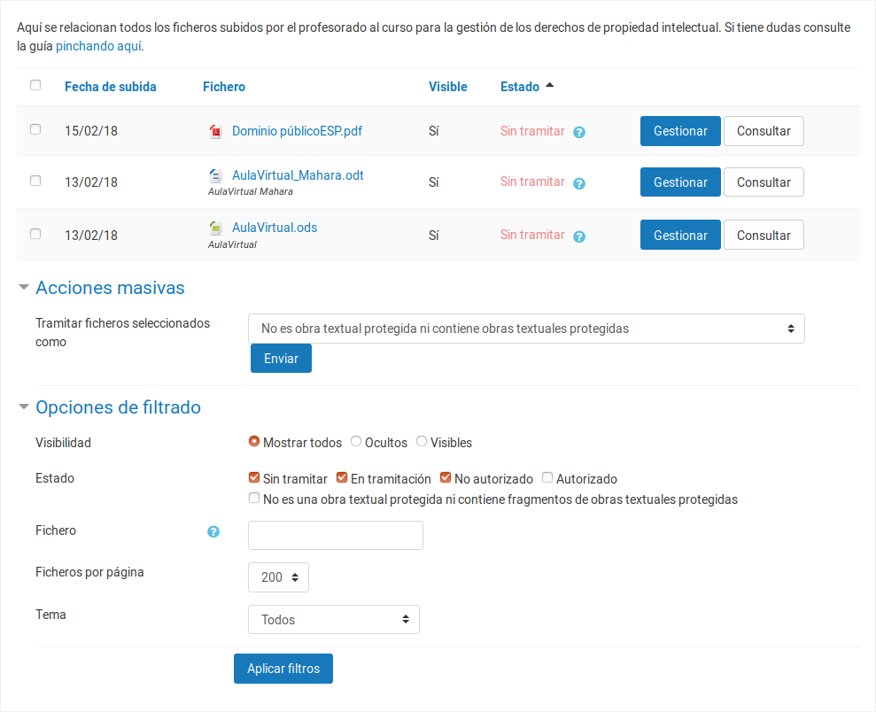
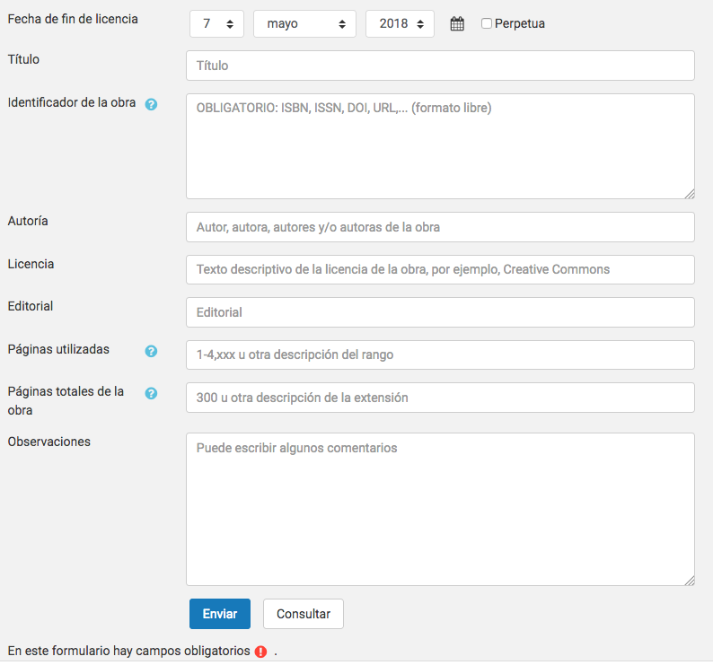

# Introducción

La primera parte de esta guía proporciona una orientación al profesorado sobre
sus obligaciones y derechos cuando se publica una obra o un fragmento de una
obra en el aula virtual.

La guía se centra en las obras impresas o susceptibles de serlo y en obras
plásticas aisladas. No se considera otro tipo de obras (audiovisuales,
música...) porque:

- el [Texto Refundido de la Ley de Propiedad
Intelectual](https://www.boe.es/buscar/act.php?id=BOE-A-1996-8930) (TRLPI) da un tratamiento específico a este tipo de obras
- y existe un convenio entre CRUE y CEDRO-VEGAP que nos habilita para la reproducción de fragmentos de obras impresas o susceptibles de serlo (con ciertas limitaciones).

En ausencia de convenio con EGEDA, SGAE u otras entidades de gestión, no
deberían subirse al aula virtual obras o fragmentos de obras de naturaleza
audiovisual, a menos que se cuente con la correspondiente licencia. Es posible
incluir en el aula virtual enlaces a servicios que publiquen algunas de estas
obras si lo hacen cumpliendo con la legalidad.

La segunda parte de esta guía describe el sistema de gestión de derechos de
propiedad intelectual integrado en el aula virtual de la Universitat Jaume I.
El sistema trata de asegurar de que los usos de obras o de fragmentos de obras
impresas o susceptibles de serlo se ajustan a la legalidad. Al mismo tiempo,
recopilan información relevante para asegurar que podemos determinar criterios
de reparto justo de la remuneración equitativa a la que da derecho la ley en
determinados casos.

# Derechos y deberes respecto de la publicación de obras protegidas en el aula virtual

El TRLPI determina los derechos del autor de obras literarias, artísticas o
científicas. El autor tiene el derecho exclusivo a la explotación de su obra en
cualquier forma (artículo 2) y puede transmitirlos por escrito (artículo 45) a
otras personas físicas o jurídicas (artículos 42 y 43).

La puesta a disposición de los estudiantes del fragmento de una obra a través
del aula virtual es un acto de **comunicación pública** (artículo 20) que
facilita su **reproducción** (artículo 18). Este acto **requiere la
autorización** del titular de los derechos de explotación, con las excepciones
que determina la ley, y **puede generar obligaciones económicas** para la
universidad.

Así pues, conviene distinguir entre la necesidad o no de disponer de
autorización y la generación o no de obligaciones económicas.

## Publicación de una obra de dominio público

Una obra es de dominio público cuando está libre de toda exclusividad en su
acceso y uso. En España, las obras pasan a ser de dominio público cuando han
transcurrido setenta años desde la muerte del autor (artículo 26).

La comunicación pública y reproducción de obras de dominio público **no
requiere autorización** y **no genera obligaciones económicas**.

Es nuestra responsabilidad asegurarnos de que una obra es de dominio público
antes de publicarla en el aula virtual.

## Reproducción de un pequeño fragmento de una obra protegida

Los centros de educación reglada, como las Universidades, **no necesitan
autorización** del titular de los derechos cuando reproducen *pequeños
fragmentos* de obras u *obras aisladas de carácter plástico o fotográfico
figurativo* (artículo 32.3), siempre que el uso se limite a la ilustración de la
actividad educativa y se use el nombre del autor y la fuente. La obra de la que
se extraen los pequeños fragmentos *no puede ser un libro de texto o manual
universitario* (artículo 32.3).

Se entiende por *pequeño fragmento* un extracto o porción cuantitativamente
poco relevante con respecto del conjunto de la obra. Este tipo de actos **no
genera ninguna obligación económica** para la Universidad (artículo 32.3). El
TRLPI no detalla los umbrales que determinan con certeza si una porción de una
obra impresa o audiovisual puede calificarse de *pequeño fragmento*, por lo que
debe actuarse con prudencia.

## Reproducción parcial de una obra protegida

Según el artículo 32.4 del TRLPI, las universidades **no necesitan
autorización** del titular de los derechos para llevar a cabo actos de
*reproducción parcial de obras impresas (o susceptibles de serlo)* con fines
educativos. La reproducción debe limitarse a fragmentos consistentes en:

- un *capítulo de libro*,
- un *artículo de revista* (o extensión equivalente en publicación asimilada),
- o una porción cuya extensión no supere el *10% del total de la obra*.

Solo los estudiantes del curso (o sus profesores) han de poder acceder al
fragmento, por lo que el curso del aula virtual en el que se aloja el fragmento
*no puede estar abierto al público*.

En los siguiente casos la publicación **no genera obligaciones económicas**
para la universidad (artículo 32.4):

- Cuando somos los titulares de los derechos de propiedad intelectual y
acordamos la puesta a disposición de la obra en el aula virtual.
- Cuando la propia universidad es cesionaria de los derechos de explotación,
es decir, cuando la publicación es editada por el Servicio de
Publicaciones de la UJI.

En el resto de casos, se genera una **obligación económica** para la
universidad que **ya está siendo satisfecha**. La Conferencia de Rectores de
Universidades Españolas (CRUE) suscribió un convenio con las entidades de
gestión CEDRO y VEGAP que da cobertura a la reproducción de fragmentos de obras
impresas o susceptibles de serlo hasta el 31 de diciembre de 2018. El convenio
determina una cuantía anual que es abonada por el conjunto de las universidades
y que permite que los autores perciban, irrenunciablemente, una *remuneración
equitativa* por la publicación de fragmentos de sus obras. La remuneración
equitativa ha de ser gestionada, necesariamente, por una *entidad de gestión* de derechos de propiedad intelectual.

Para asegurar que los autores perciben esta remuneración equitativa se precisa
de un sistema que registre los usos realizados en el aula virtual. El sistema
de gestión de derechos que ponemos en explotación en el segundo semestre del
curso 2017/2018 tiene ese objetivo.

## Reproducción de una obra completa o de un fragmento significativo de una obra

Cualquier otro uso de una obra o de un fragmento de una obra **requiere
autorización expresa** del titular de los derechos y, por regla general, **está
sujeta a un pago**. El contrato que formaliza una cesión específica de uso,
copia o distribución de una obra recibe el nombre de **licencia**.

La universidad facilita la tramitación de licencias a través de un formulario
en el sistema de gestión de derechos del aula virtual. Los costes que ocasione
la licencia deberán asumirse presupuestariamente por el departamento o centro
responsable de la asignatura.

La tramitación de una licencia no es un proceso inmediato, por lo que debe
planificarse y ejecutarse con suficiente antelación al período en que se
necesite el uso efectivo de la obra. El proceso puede durar entre unos pocos
días y varias semanas.

Por favor, inicia los trámites de gestión de licencia solo si dispones de
crédito presupuestario para cubrir el gasto correspondiente y actúa con
suficiente antelación.

# El aula virtual: módulo de gestión de derechos de propiedad intelectual (GDPI)

Con objeto de asegurar el cumplimiento del TRLPI en el aula virtual se ha
integrado un módulo de gestión de derechos de propiedad intelectual
desarrollado por la universidad.

Este apartado describe el uso del módulo que se ha integrado en todos los
cursos del aula virtual.

## Subida de documentos al aula virtual

Durante el acto de subida del documento no es necesario cumplimentar ningún
dato relativo a la gestión de derechos de propiedad intelectual.

El fichero, que pasa a estar inmediatamente accesible para los estudiantes (a
menos que se oculte manualmente) se integra en una lista de ficheros de los que
está pendiente la gestión de derechos. Si transcurre un plazo breve (un día
hábil) y no se ha efectuado la tramitación pertinente, el documento se ocultará
a los estudiantes.

Es recomendable, por tanto, que tan pronto se publique un documento se proceda
a tramitar la correspondiente gestión de derechos.

El menú principal del aula virtual (panel a mano izquierda) incluye una opción para acceder a la gestión de derechos. Si hay documentos pendientes de procesar, aparecerá además un aviso en la pantalla principal del curso.

## Aviso de que hay documentos pendientes de gestión de derechos

Si el curso contiene documentos cuya gestión de derechos está pendiente,
aparece un aviso como este:

Pinchando en el botón se accede a la página principal del módulo GDPI, desde la
que podemos iniciar el proceso de gestión de cada documento y comprobar su
estado. También se puede llegar a esta página a través del menú principal del
curso.

## Pantalla principal del módulo GDPI

La pantalla principal presenta este aspecto:

Aunque las opciones de filtrado aparecen antes, describimos primero el listado de documentos.

### Listado de documentos

En el listado aparecen todos los documentos correspondientes a obras impresas o susceptibles de serlo y que se han subido al aula virtual. Hay tres columnas informativas:

- **Fichero**: Nombre del fichero. Pinchando en él se accede al documento para su descarga.
- **Oculto**: Indica si el fichero es accesible por los estudiantes en este momento.
- **Estado de tramitación**: Es el estado de tramitación de la gestión de derechos de propiedad intelectual.

> **PENDIENTE**: La columna Autorización debería pasar a ser Estado de Tramitación. El orden de las columnas debería de ser el de la enumeración. anterior.

Acompaña a cada documento, además, la posibilidad de efectuar dos acciones:

- **Consulta**: Dirige una solicitud de asesoramiento al personal especialista en gestión de derechos. Nos permite resolver cualquier duda acerca de la gestión de derechos del documento.
- **Tramitar**: Dirige al formulario de gestión de derechos del documento.

> **PENDIENTE**: Sustituir Consulta por "Solicitar asesoramiento"

> **PENDIENTE**: Hablar sobre esta observación de Ricardo: Esta parte del texto no es del todo correcta: "El efectuar una consulta, la columna “Autorización” pasará a mostrar el texto “Esperando respuesta”. Cuando el especialista haya dado respuesta a la consulta, el texto de la columna “Autorización” pasará a ser “Consulta respondida”. La respuesta se recibe en la dirección de correo electrónico del profesor que ha efectuado la consulta." Ahora mismo, esperando respuesta lo usamos para cuando biblioteca tiene que aprobar/denegar en su interfaz una petición de tramitación. Para el tema de las consultas no tenemos control del flujo y no sabemos cuando se han contestado, por lo que tampoco podemos sacar lo de "Consulta respondida".

### Filtro de documentos

Dado que esta pantalla contiene un listado con todos los documentos publicados
en el aula virtual y este puede ser extenso, se proporcionan opciones de
filtrado que nos permiten centrar la atención en los documentos de interés.

La **primera opción** del filtro permite seleccionar *todos los documentos*, solo los *ocultos* para los estudiantes o solo los *visibles* para los estudiantes.

La **segunda opción** del filtro selecciona los documentos en función del estado
de tramitación de la gestión de derechos o del resultado de las consultas
realizadas sobre él.

### Acción "Consulta"

Al pulsar en el botón "Consulta" aparece un formulario como este:

> **PENDIENTE**: El título "Solicitar asesoramiento" debería cambiarse por "Efectuar
> consulta a especialista". Alternativamente, Cambiar el botón "Consultar" por
> "Solicitar asesoramiento" y mantener este título. Es un tema de coherencia.

En el cajetín podemos escribir la duda que tengamos. La consulta se dirigirá por correo electrónico a un especialista en gestión de derechos intelectuales que tratará de resolverla en el más breve plazo posible.

El efectuar una consulta, la columna "Autorización" pasará a mostrar el texto "*Esperando respuesta*". Cuando el especialista haya dado respuesta a la consulta, el texto de la columna "Autorización" pasará a ser "*Consulta respondida*". La respuesta se recibe en la dirección de correo electrónico del profesor que ha efectuado la consulta.

### Acción "Tramitar"

El botón "Tramitar" permite iniciar la tramitación de los derechos de propiedad intelectual y conduce a un formulario algo más complejo.

El formulario ofrece una barra horizontal de navegación en la zona superior. La
zona principal de la pantalla se divide en un visor del documento que
facilita su identificación y una zona con los campos que deben rellenarse por el usuario.

La primera cuestión que debe responderse es quién es el titular de los derechos de reproducción.

#### Obras de autoría propia, editadas por la universidad, de dominio público o consistentes en una obra plástica aislada

> **PENDIENTE**: Unir los dos botones de radio en uno solo en uno Además, cambiar "Titularidad de los derechos" por "Tipo de obra"

La primera opción abarca los siguientes casos:

- El autor o autores de la obra son profesores de la universidad y han realizado la obra en el marco de su relación laboral con esta
- La obra ha sido editada por el servicio de publicaciones de la universidad
- La obra es de dominio público
- Se trata de una obra plástica aislada o una fotografía figurativa

En todos estos casos no se requiere autorización y la reproducción no genera obligaciones económicas para la universidad.

Al seleccionar esta opción aparece un campo en el que podemos incluir un comentario opcional que se vinculara al documento.

Al pulsar el botón "Tramitar", el documento se publicará en el aula virtual. En ediciones futuras del curso, el documento mantendrá esta clasificación y no tendrá que tramitarse nuevamente la gestión de derechos.

#### Otras

> **PENDIENTE**: Cambiar "Obra impresa o susceptible de serlo" por "Otros"

Al seleccionar esta opción se despliega a un formulario más complejo, ya que hay diferentes supuestos que tratar. Las obras que englobamos en esta opción generan una obligación para la universidad (que puede estar satisfecha o no) y su publicación puede requerir autorización o no.

La siguiente opción permite decidir si se precisa autorización. Hay tres posibilidades:

> **NOTA** Cambiar los rótulos

- **Es un capítulo, un artículo o su extensión es menor del 10% del total de la obra**: No se necesita autorización y las obligaciones económicas se han satisfecho en el marco del convenio CRUE-CEDRO/VEGAP.
- **Dispongo de licencia en vigor**: Ya se gestionó uan licencia que permite utilizar la obra en el aula virtual y la licencia está en vigor.
- **Necesito tramitar una licencia**: Para elegir esta opción se debe disponer de crédito presupuestario. Dado que es posible que no se conozca el coste de la licencia, esta opción conduce a un proceso manual de gestión de obtención de información que puede finalizar con la adquisición de una licencia.

En cualquiera de los tres supuestos hay que rellenar una serie de campos que identifiquen la obra publicada. Son estos:

- **Título** (opcional): Nombre que identifque la obra o fragmento de la obra que se está utilizando.
- **Identificador de la obra** (requerido): Código de identificación de la obra, si lo hay. Si la obra dispone de ISBN o ISSN, debe usarse este identificador. Alternativamente, puede usarse algún otro descriptor que permita identificar uniívocamente al obra utilizada (DOI, URL, etcétera).
- **Autor/es** (opcional): Nombre del autor o autores.
- **Licencia** (opcional): Tipo de licencia bajo la que se ha publicado la obra. Es un campo opcional
- **Editorial** (opcional): Editorial que ha publicado la obra.
- **Páginas del fragmento**: número de páginas del fragmento utilizado. Si la obra no está paginada (se trata de un libro electrónico, por ejemplo) conviene indicar el porcentaje del fragmento respecto del total de la obra.
- **Páginas totales**: Número total de páginas de la obra. Si la obra no está paginada, puede dejarse en blanco.
- **Numero de matriculados**: El número de matriculados se genera automáticamente a partir del número de inscritos en el curso. Dado que este número puede variar en el tiempo o ser incorrecto en el momento de publicación del documento, su valor puede editarse para que refleje la realidad (aunque sea aproximado).
- **Observaciones**: Campo de formato libre con un comentario que acompañará al documento.

Al pulsar "Tramitar" el documento se publicará en el aula virtual y pasará a supervisión de especialista en gestión de derechos de autor. Si detectan algún problema, el documento se ocultará a los estudiantes y recibirá información con una descripción del problema detectado.

> **PENDIENTE**: Comentar texto Ricardo: En la afirmación "Al pulsar “Tramitar” el documento se publicará en el aula virtual y pasará a supervisión de especialista en gestión de derechos de autor.", sí que pasa a revisión del especialista, pero ahora mismo no cambiamos el estado del documento el cual si estaba oculto continuará oculto.

La opción "Dispongo de licencia en vigor" hace que el formulario incluya un campo adicional en el seleccionar la fecha en que la licencia se extingue:

> **PENDIENTE**: Falta describir los estados de tramitación. Los nombres me parecen, ahora, un poco confusos.

- Sin tramitación
- Consulta
- Esperando respuesta
- No necesaria
- Por licencia
- No autorizado

