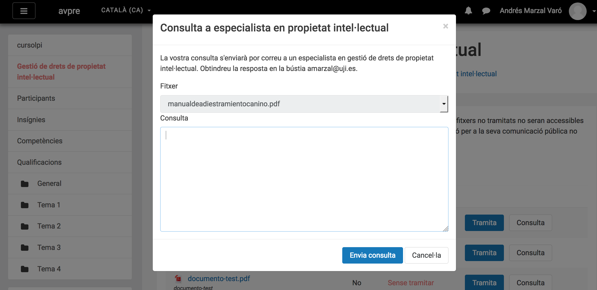
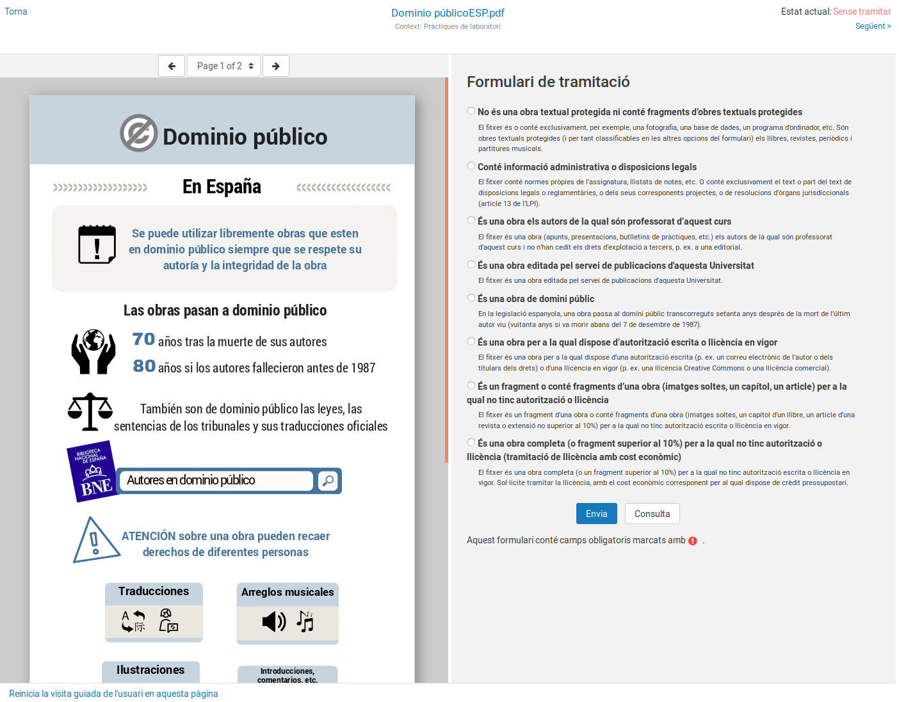
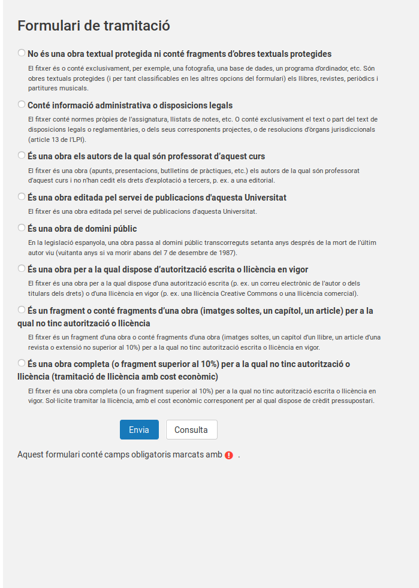

# Introducció

La primera part d'aquesta guia proporciona una orientació al professorat sobre
les seues obligacions i drets en publicar una obra o fragment d'una obra a
l'Aula Virtual. Trobaràs més informació en
[http://www.uji.es/serveis/cd/bib/serveis/investigacio/pi](http://www.uji.es/serveis/cd/bib/serveis/investigacio/pi).
La segona part d'aquesta guia descriu el mòdul de Gestió de Drets de Propietat
Intel·lectual (GDPI) integrat a l'Aula Virtual de la Universitat Jaume I.

Únicament considerem obres impreses o susceptibles de ser-ho (d'ara endavant,
"obres impreses") i obres plàstiques aïllades. No considerem altre tipus
d'obres (audiovisuals, música ...) perquè:

- el [**Text refós de la Llei de Propietat Intel·lectual
(TRLPI)**](https://www.boe.es/buscar/act.php?id=BOE-A-1996-8930) dóna un
tractament específic a aquest tipus d'obres que permet la seva publicació en un
context educatiu
- i existeix un **conveni entre CRUE**[^1] **i CEDRO**[^2]**-VEGAP**[^3] que ens
habilita per a la reproducció de fragments d'obres impreses amb certes
limitacions.

[^1]: [CRUE](http://www.crue.org/) és la Conferència de Rectors d'Universitats Espanyoles.

[^2]: [CEDRO](http://www.cedro.org/) és el Centro Español de Derechos Reprográficos, una entitat de gestió de drets d'autor per a autors i editors d'obras impresas o susceptibles de ser-ho.

[^3]: [VEGAP](http://www.vegap.es/) és la Visual Entidad de Gestión de Artistas Plásticos, una entitat de gestió de drets d'autor per pintors, escultors, fotògrafs, il·lustradors, disenyadores, videoartistes, arquitectes i creadors visuals en general.

En absència de conveni amb EGEDA, SGAE o altres entitats de gestió, no
s'haurien de publicar a l'Aula Virtual obres o fragments d'obres de
naturalesa audiovisual si no es compta amb les corresponents llicències.

El mòdul de gestió de drets de propietat intel·lectual de l'aula virtual tracta
d'assegurar que els usos d'obres o de fragments d'obres impreses s'ajusten a la
legalitat. Al mateix temps, recopila informació per determinar criteris de
repartiment just de la remuneració equitativa a la qual dóna dret la llei.

La informació recollida sobre les obres publicades és auditable per les
entitats de gestió, és a dir, aquestes poden verificar la veracitat de les
dades que donem sobre elles. Això implica que les entitats de gestió puguen
accedir puntualment al contingut dels fitxers al costat de les seues dades
descriptives[^4]. *En cap cas pot accedir l'entitat de gestió a un curs de
l'aula virtual: sols pot auditar el contingut i les dades del fitxer que conté
una obra o fragment d'obra impresa*.

[^4]: Però en cap cas poden accedir al documents administratius que contenen
informació normativa de les assignatures, resultats de avaluació dels alumnes,
etcètera.

# Drets i deures respecte de la publicació a l'Aula Virtual d'obres protegides

El Text Refís de la Llei de Propietat Intel·lectual determina els drets de
l'autor d'obres literàries, artístiques o científiques. L'autor té el dret
exclusiu a l'explotació de la seua obra en qualsevol forma (article 2 del
TRLPI) i pot transmetre'l per escrit (Article 45) a altres persones físiques o
jurídiques (articles 42 i 43).

La posada a disposició dels estudiants del fragment d'una obra a través de
l'Aula Virtual constitueix un acte de **comunicació pública** (article 20) que
facilita la seva **reproducció** (article 18). Aquest acte **requereix la
autorització** del titular dels drets d'explotació, amb les excepcions que
determina la llei (que comentem més endavant), i **pot generar obligacions
econòmiques** per a la universitat.

Així doncs, és important distingir entre la necessitat o no de disposar
d'**autorització** i la generació o no d'**obligacions econòmiques**.

## Publicació d'una obra de domini públic

Una obra és de domini públic quan està lliure de tota exclusivitat en el seu
accés i ús. A Espanya, les obres passen a ser de domini públic quan han
transcorregut setanta anys des de la mort de l'autor (article 26).

La comunicació pública i reproducció d'obres de domini públic **no requereix
autorització** i **no genera obligacions econòmiques**. És responsabilitat de
qui publica un document assegurar-se que l'obra és de domini públic abans de
publicar-la a l'Aula Virtual.

## Reproducció d'un xicotet fragment d'una obra protegida

Els centres d'educació reglada, com les universitats, **no necessiten
autorització** del titular dels drets quan reprodueixen *xicotets fragments*
d'obres o *obres aïllades de caràcter plàstic o fotogràfic figuratiu* (article
32.3), sempre que l'ús es limiti a la il·lustració de la activitat educativa i
s'utilitze el nom de l'autor i la font. L'obra de la qual s'extreuen els xicotets
fragments *no pot ser un llibre de text o manual universitari* (article 32.3).

S'entén per *xicotet fragment* un extracte o porció quantitativament poc
rellevant respecte del conjunt de l'obra. Aquest tipus d'actes **no genera cap
obligació econòmica** per la Universitat (article 32.3). El TRLPI no detalla
els llindars que determinen amb certesa si una porció d'una obra impresa o
audiovisual pot qualificar-se de *xicotet fragment*, de manera que s'ha
d'extremar la prudència.

## Reproducció parcial d'una obra protegida

Segons l'article 32.4 del TRLPI, les universitats **no necessiten
autorització** del titular dels drets per a dur a terme actes de *reproducció
parcial d'obres impreses* amb fins educatius. La reproducció s'ha de limitar a
fragments consistents en:

- 1 *capítol de llibre*,
- 1 *article de revista* (o extensió equivalent a publicació assimilada),
- o una porció l'extensió de la qual no supera el *10% del total de l'obra*.

Només els estudiants del curs (o els seus professors) han de poder accedir al
fragment, de manera que el curs de l'Aula Virtual en què s'allotja el fragment
*no pot estar obert al públic en general*.

La publicació del fragment genera **obligació econòmica** per a la universitat
que **ja està sent satisfeta**. La CRUE va subscriure un conveni amb les
entitats de gestió CEDRO i VEGAP que dóna cobertura a la publicació a l'Aula
Virtual de fragments d'obres impreses *fins al 31 de desembre de 2018*. El
conveni determina una quantia anual que és abonada pel conjunt de les
universitats i que permet que els autors percebin una *remuneració equitativa*
per aquests actes. La remuneració equitativa ha de ser gestionada,
necessàriament, per una *entitat de gestió* de drets de propietat
intel·lectual.

Per assegurar que els autors perceben la remuneració equitativa cal que el
sistema registre els usos realitzats a l'Aula Virtual i que les entitats de
gestió tinguen accés a aquesta informació. El sistema de gestió de drets que
posem en explotació en el segon semestre del curs 2017/2018 té aquest objectiu.

Hi ha un parell d'excepcions que convé conèixer. La publicació d'un fragment
d'una obra com el descrit **no genera obligacions econòmiques** per a la
universitat (Article 32.4) en el següents casos:

- Quan **som els titulars dels drets de propietat intel·lectual** i vam acordar la posada a disposició de l'obra a l'Aula Virtual.
- Quan **la pròpia universitat és cessionària dels drets d'explotació**, és a dir, quan la publicació ha estat editada pel Servei de Publicacions de l'UJI.

## Reproducció d'una obra completa o d'un fragment significatiu d'una obra

Qualsevol altre ús d'una obra o d'un fragment d'una obra **requereix
autorització expressa** del titular dels drets i, per regla general, **està
subjecta a un pagament**. El contracte que formalitza una cessió específica
d'ús, còpia o distribució d'una obra rep el nom de **llicència**.

La gestió de la llicència pot realitzar-se a través de la pàgina
[https://www.conlicencia.com/](https://www.conlicencia.com/) o contactant amb
l'editorial. La llicència està subjecta a un pagament, per la qual cosa cal
disposar de crèdit pressupostari. La tramitació d'una llicència no és un procés
immediat ni està automatitzat, per la qual cosa s'ha de planificar i executar
amb suficient antelació al període en què es necessite l'ús efectiu de l'obra.
El procés es semblant al d'adquisició d'un llibre, no depèn només de la universitat i pot tardar dies, setmanes o mesos. Si creu que necessita una llicència, considere abans la conveniència d'adquirir l'obra impresa o en format electrònic per a la seua posada a disposició dels estudiants a través de la Biblioteca.

# El mòdul de gestió de drets de propietat intel·lectual de l'Aula Virtual

A fi d'assegurar el compliment del TRLPI a l'Aula Virtual s'ha desenvolupat i
integrat un mòdul de Gestió de Drets de Propietat Intel·lectual (GDPI).

Tot i que el sistema s'ha dissenyat pensant en interferir el menys possible en
l'activitat normal de l'Aula Virtual, es requereix la col·laboració del
professorat. S'ha tractat de facilitar al màxim el procés de pujada i
publicació de documents, però s'ha d'efectuar un breu procés de tramitació per
a cadascun d'ells. L'objectiu és demanar la informació que permeta
**determinar** si el fitxer necessita **autorització de l'autor** i si la seva
reproducció **genera obligacions econòmiques** per a la universitat. En certs
casos, el professorat ha de proporcionar informació que identifiqui
inequívocament l'obra o fragment de obra utilitzada.

Cal tenir en compte que el sistema és auditable per les entitats de gestió de
drets, de manera que *sempre s'ha de proporcionar informació fidedigna*. Que el
sistema siga auditable vol dir que es permet el accés al contingut i dades de
qualsevol fitxer, però només a l'efecte de comprovar que s'efectua una correcta
gestió de drets de propietat intel·lectual. Naturalment, els fitxers que
contenen informació administrativa pròpia de l'assignatura (normativa
d'avaluació, qualificacions d'estudiants ...) estan exclosos de l'accés per
part de les entitats de gestió.

## Pujada de documents a l'Aula Virtual

Durant l'acte de pujada del document no és necessari omplir cap dada relativa a
la gestió de drets de propietat intel·lectual.

El fitxer, que passa a estar immediatament disponible per als estudiants (a
menys que s'oculti manualment l'activitat) s'integra en una llista de fitxers
dels quals està pendent la gestió de drets. Si, transcorregut un termini, no
s'ha efectuat la tramitació pertinent, l'activitat que conté el document
s'amagarà als estudiants automàticament.

És recomanable, per tant, que *tan aviat es publiqui un document es procedeixi
a tramitar la corresponent gestió de drets*.

El menú principal de l'Aula Virtual (panell a mà esquerra) inclou una opció
per accedir a la pantalla principal del mòdul GDPI:

Si hi ha documents pendents de processar, apareixerà un avís a la pantalla
principal com aquest:

Punxant en el botó "Iniciar revisió" s'accedeix a la pàgina principal del mòdul
GDPI. Des d'ella podem iniciar el procés de gestió de cada document i comprovar
el seu estat. Convé recordar que només els fitxers que poden contenir obres
impreses s'han de sotmetre a aquest procés de gestió de drets.

## Pantalla principal del mòdul GDPI

La pantalla principal presenta aquest aspecte:

A la pantalla apareix un llistat amb tots els fitxers que, pel seu tipus
(Document PDF, document Word, document OpenOffice/LibreOffice...), poden
correspondre amb obres impreses. Sota el llistat es mostren opcions per filtrar
la relació de documents que es mostren en el mateix.

### Llistat de documents

El llistat presenta tres columnes:

- **Fitxer**: Nom del fitxer. Prement en ell s'accedeix al document per a la seua descàrrega.
- **Ocult**: Indica si el fitxer és accessible pels estudiants en aquest moment.
- **Estat**: Mostra l'estat de tramitació de la gestió de drets de propietat intel·lectual.

És possible efectuar dues accions per a cada document:

- **Tramitar**: Dirigeix al formulari de gestió de drets del document.
- **Mira**: Dirigeix una sol·licitud d'assessorament a personal especialista en gestió de drets de propietat intel·lectual per resoldre dubtes relatius al fitxer.

### Filtre de documents

Atès que aquesta pantalla conté un llistat amb tots els documents publicats
a l'Aula Virtual i aquest pot ser extens, es proporcionen opcions de
filtrat que ens permeten centrar l'atenció en els documents d'interès.

La **primera opció** del filtre permet seleccionar
- *tots els documents* el tipus permet deduir que és una obra impresa,
- només els documents que romanen *ocults* per als estudiants (recordeu que els documents dels quals no s'ha fet cap gestió passen a aquest estat en un determinat termini de temps),
- o només els *visibles* per als estudiants.

La **segona opció** del filtre selecciona els documents en funció de l'estat
de tramitació:

- *Sense tramitar*: fitxers que tenen pendent la tramitació de la gestió de drets de propietat intel·lectual.
- *En tramitació*: S'ha iniciat un procediment de tramitació d'adquisició de llicència que encara no s'ha conclòs.
- *Autoritzat*: fitxers dels quals es completat amb èxit la tramitació i poden publicar-se en l'Aula Virtual.
- *No autoritzat*: fitxers per als que s'ha resolt que no és possible efectuar la publicació a l'Aula Virtual.

### Acció "Consulta"

En prémer el botó "Consulta" apareix un formulari com aquest:

En la capseta de text podem expressar el dubte. La consulta es dirigirà per
correu electrònic a un especialista en gestió de drets de propietat
intel·lectual que intentarà resoldre-la en el més breu termini possible. la
resposta es rebrà per correu electrònic. El mòdul GDPI no fa un seguiment
d'aquest procés.

### Acció "Tramitar"

El botó "Tramitar" permet iniciar la tramitació dels drets de propietat
intel·lectual i condueix a un formulari una mica més complex.

El formulari ofereix una barra horitzontal de navegació a la zona superior. la
zona principal de la pantalla es divideix en un visor PDF que facilita la seva
identificació i possibilita la seva descàrrega i una zona amb els camps que ha de
omplir l'usuari.

S'ha de triar una opció de les que apareixen a la dreta de l'etiqueta "El
document conté". Amb elles es classifica el document en relació amb dues qüestions:
- Es **necessita autorització** expressa del titular dels drets, si n'hi ha?
- Es **genera una obligació econòmica** per a la universitat?
- Són **auditable per una entitat de gestió** tant el contingut com les dades del fitxer?

Estudiem detingudament cadascuna de les opcions:

#### Opció 1: "Informació administrativa (normativa interna, llistats de notes ...)"

Els documents de naturalesa administrativa (normatives d'assignatura, rúbriques
d'avaluació, llistats amb els resultats d'avaluació d'estudiants, etcètera) es
poden publicar sense necessitat d'obtenir cap autorització. Aquests documents
són propis de la universitat i queden fora de l'àmbit de la gestió de drets de
propietat intel·lectual. El contingut del document no pot ser consultat per les
entitats de gestió com a part d'un procés d'auditoria, ja que pot contenir
informació de caràcter personal.

Si s'escull aquesta opció, no cal proporcionar dades descriptives del document.
Feu clic al botó "Tramitar" per processar el document.

#### Opció 2: "Una obra de titularitat del professorat de la universitat"

Quan l'autor o autors són part del professorat de la universitat, han
realitzat l'obra com a part del seu treball i no han cedit els drets de
explotació a un tercer, el document es pot publicar a l'Aula Virtual i no
es generen obligacions econòmiques per a la universitat.

Aquest és el cas habitual dels butlletins de problemes, exàmens d'assignatura,
apunts de classe, etcètera.

Si s'escull aquesta opció, no cal proporcionar dades relatives al
document. Feu clic al botó "Tramitar" per processar el document.

El contingut del document pot ser consultat per les entitats de gestió com a part d'un procés d'auditoria.

#### Opció 3: "Una obra editada pel servei de publicacions de la universitat"

Si l'obra ha estat publicada per la universitat i és cessionària dels drets
d'explotació, no es requereix autorització per a la publicació a l'Aula
Virtual. La reproducció no genera obligacions econòmiques per a la universitat.

CRUE està treballant en la signatura d'un conveni que permeti a totes les
universitats compartir els seus fons editorials. De moment, només es pot
publicar sense autorització una obra del fons editorial de l'UJI.

Si s'escull aquesta opció, no cal proporcionar dades relatives al
document. Feu clic al botó "Tramitar" per processar el document.

El contingut del document pot ser consultat per les entitats de gestió com a part d'un procés d'auditoria.

#### Opció 4: "Una obres de domini públic"

Les obres de domini públic es poden publicar sense autorització i el seu ús no
genera obligacions econòmiques.

Si s'escull aquesta opció, no cal proporcionar dades relatives al
document. Feu clic al botó "Tramitar" per processar el document.

El contingut del document pot ser consultat per les entitats de gestió com a part d'un procés d'auditoria.

#### Opció 5: "Un fragment d'una obra (capítol de llibre, article o extensió no superior al 10%)"

Si el fragment té una entitat relativa (és un capítol de llibre, un article de
revista o no excedeix el 10% del total de l'obra), aquesta opció obre un
formulari amb camps que identifiquen aquest fragment.

- **Títol** (opcional): Nom que identifiqui l'obra o fragment de l'obra que s'està utilitzant.
- **Identificador de l'obra** (requerit): Codi d'identificació de l'obra, si n'hi ha. Si l'obra disposa d'ISBN o ISSN, ha d'usar-aquest identificador. Alternativament, pot usar-se algun altre descriptor que permeti identificar l'obra utilitzada (DOI, URL, etcètera).
- **Autor/s** (opcional): Nom de l'autor o autors.
- **Llicència** (opcional): Tipus de llicència sota la qual s'ha publicat l'obra. És un camp opcional.
- **Editorial** (opcional): Editorial que ha publicat l'obra.
- **Pàgines**: nombre de pàgines del fragment utilitzat. Si l'obra no està paginada (es tracta d'un llibre electrònic, per exemple) convé indicar el percentatge del fragment respecte del total de l'obra.
- **Pàgines totals**: Nombre total de pàgines de l'obra. Si l'obra no està paginada pot deixar-se en blanc.
- **Nombre de matriculats**: El nombre de matriculats es genera automàticament a partir del nombre d'inscrits al curs. Atès que aquest nombre pot variar en el temps o ser incorrecte en el moment de publicació del document, el seu valor pot editar-se manualment perquè reflecteixi la realitat a partir de l'experiència del professorat en edicions anteriors del curs (tot i que siga de manera aproximada).
- **Observacions**: Camp de format lliure amb un comentari que acompanyarà el document.

El fragment es pot publicar sense demanar autorització i l'obligació econòmica
que genera el seu ús ha estat satisfeta en el marc del conveni celebrat entre
CRUE i CEDRO-VEGAP. El contingut i dades del document poden ser consultats per
les entitats de gestió com a part d'un procés d'auditoria.

#### Opció 6: "Una obra de la qual disposo de llicència en vigor"

En escollir aquesta opció es desplega un formulari similar al de l'opció anterior. El formulari inclou dos camps addicionals:

- **Data de fi de llicència**: Indicar la data d'expiració de la llicència. Permet que, si escau, l'ús del mateix document en edicions posteriors del curs no forci a una nova tramitació de la gestió de drets.
- **Llicència**: Descripció de la llicència.

Les obres amb llicències que no generen obligacions econòmiques per a usos no
comercials caben en aquesta opció. És el cas de Creative Commons i altres
llicències permissives.

El contingut del document i les dades poden ser consultats per les entitats de
gestió com a part d'un procés d'auditoria.

#### Opció 7: "Altres (tramitació de llicència amb cost econòmic)"

Aquesta opció s'ha d'escollir si el document no compta amb autorització per a la seva
publicació i es disposa de crèdit pressupostari per adquirir una llicència.

L'activitat que conté el document passarà a estar oculta fins que es dispose de
la llicència. Una vegada s'haja adquirit la llicència es podrà tornar a
tramitar la gestió de drets de propietat intel·lectual del document i
mostrar-lo als estudiants del curs.

El procés d'adquisició d'una llicència no és immediat. Pot assimilar-se al
d'adquisició d'un llibre, per la qual cosa pot tardar dies, setmanes o mesos.
La tramitació de la llicència **no depèn únicament dels serveis de la
universitat**. Penseu en la conveniència d'adquirir exemplars de l'obra impresa
o llibres electrònics a través de la Biblioteca abans de tramitar la llicència
per a l'Aula Virtual.